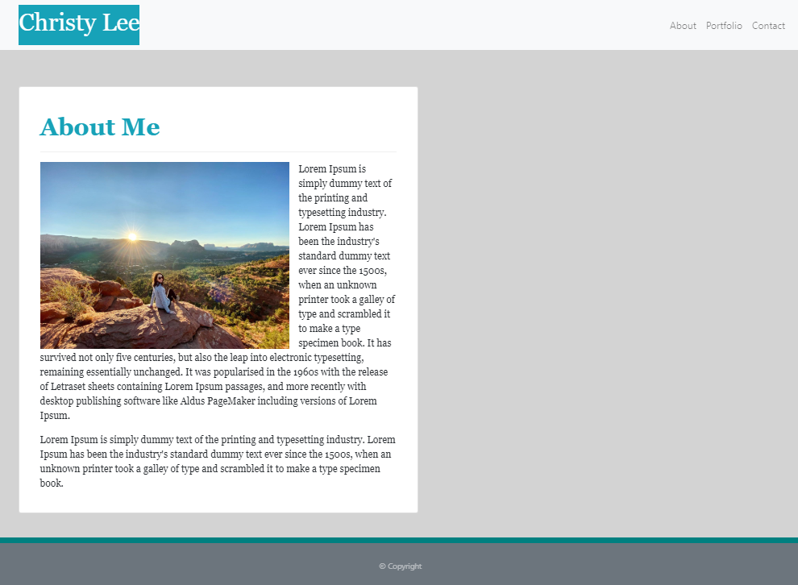
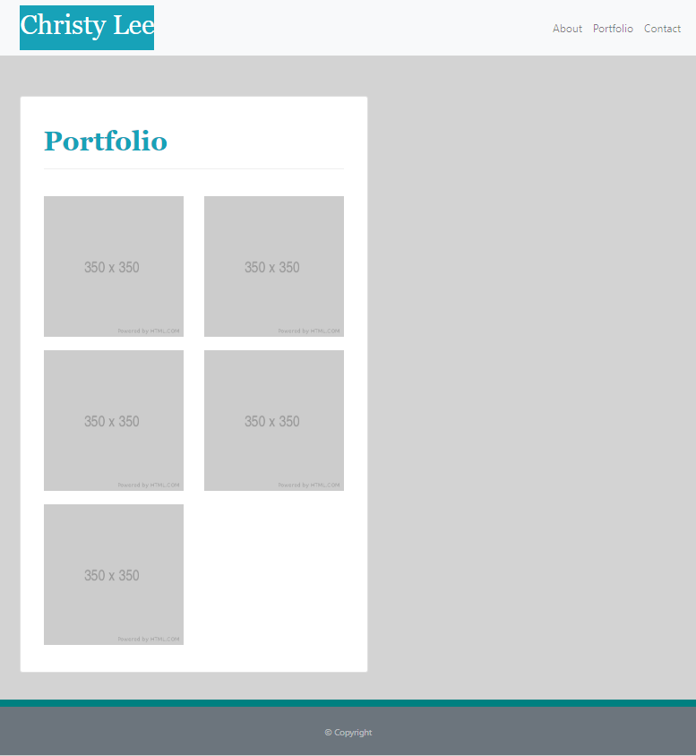

# Responsive Portfolio

Reponsive portfolio is a website designed to begin showcasing my portfolio and projects as I begin my journey as a web designer. 

With the wonderful resouces provided by Bootstrap, I was able to create and incorporate a responsive web design to automatically adjust to different screen sizes. The purpose of having a responsive web design is to make the page fit well on all devices.

I am excited to share my progress and improve my skillset throughout this experience.

 

## Coding Process

As a coding beginner, I found this project to be a little difficult to start; however, Bootstrap made it helpful for me to find majority of the source codes to kick-off this project. 

When tackling the "About Me" page, I was having issues with the grid system being too wide to my liking. After many unsuccessful attempts to shrink the width size without using a css stylesheet, I decided to incorporate and wrap Bootstrap's card code with the grid system I currently had in place. 

### Portfolio Progress Part 1

 

 

### Updated Portfolio Part 2

I had a lot of fun updating the background picture for my entire site and styling with transparent colors. Adding projects to the portfolio tab was super exciting! Lastly, I included links to my email, GitHub, LinkedIn, and Resume in the contact tab.

 

 

 

### Updated Portfolio Part 3

In this updated portfolio, I deployed to Heroku with Express routes serving up static HTML Pages. In addition, I updated my portfolio tab to include the repository and heroku deployed link of my RooTs - A Social Media Garden project. 

 

To view the live website, please navigate to the **Heroku Deployed Link** below or  [click here](https://christylee-portfolio.herokuapp.com/) to view the page.

 

## Powered By

* [BOOTSTRAP](https://getbootstrap.com/)
* [HTML](https://developer.mozilla.org/en-US/docs/Web/HTML)
* [CSS](https://developer.mozilla.org/en-US/docs/Web/CSS)
* [Node.js](https://nodejs.org/en/)
* [npm install](https://nodejs.org/en/)
* [express nodejs](https://www.npmjs.com/package/express)
* [Heroku](https://www.heroku.com)

 

### Other Resources Used

* [Visual Studio Code](https://code.visualstudio.com/)
    * [How to install VS Code](https://code.visualstudio.com/docs/setup/setup-overview)
* [GitBash](https://gitforwindows.org/)
    * [Download GitBash for Windows](https://git-scm.com/downloads)

 

## Deployed Link

* [See Live Site](https://christylee-portfolio.herokuapp.com/)

 

## Author
**Christy Lee** 

- [Github](https://github.com/christyglee)
- [LinkedIn](https://www.linkedin.com/in/christy-g-lee/)

  

## Acknowledgments

* [Bootstrap](https://getbootstrap.com/)
* [Google-Fu](https://www.google.com)
* [w3schools](https://www.w3schools.com/)
* [Stack Overflow](https://stackoverflow.com/search?q=over)
* [Heroku](https://www.heroku.com)

